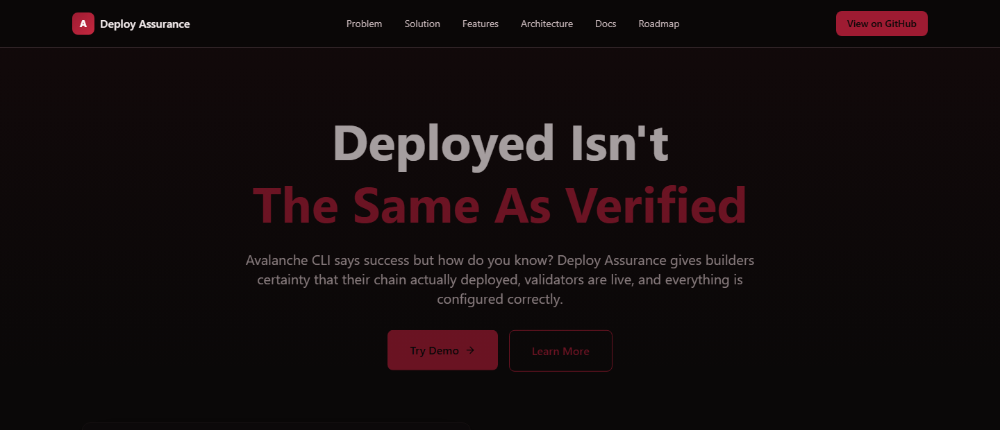
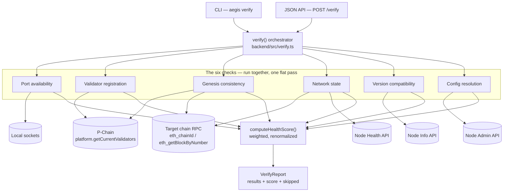
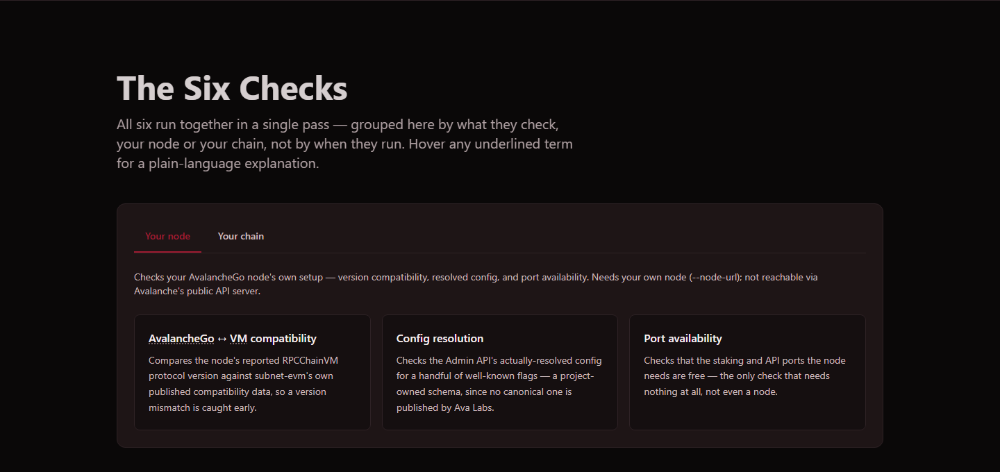
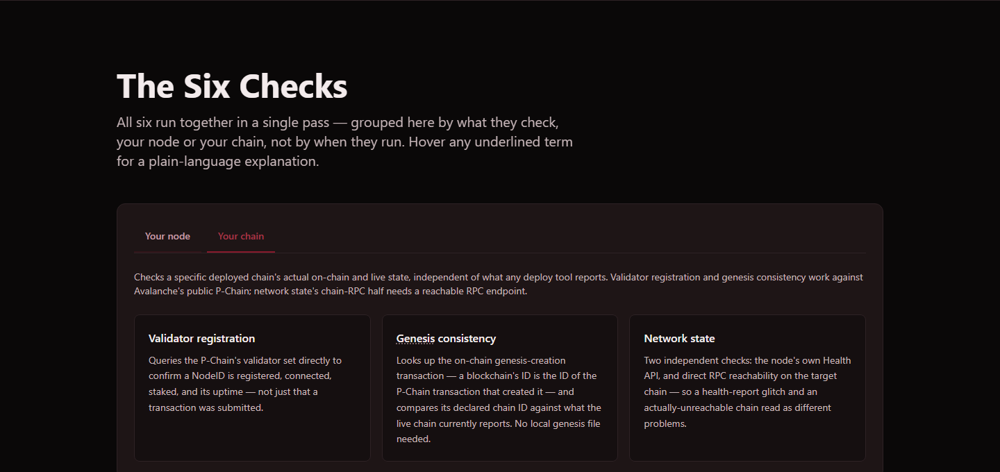
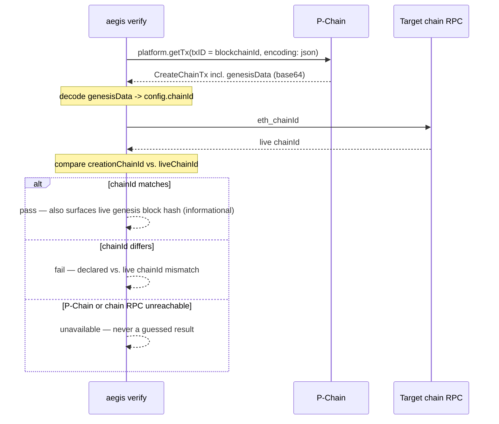
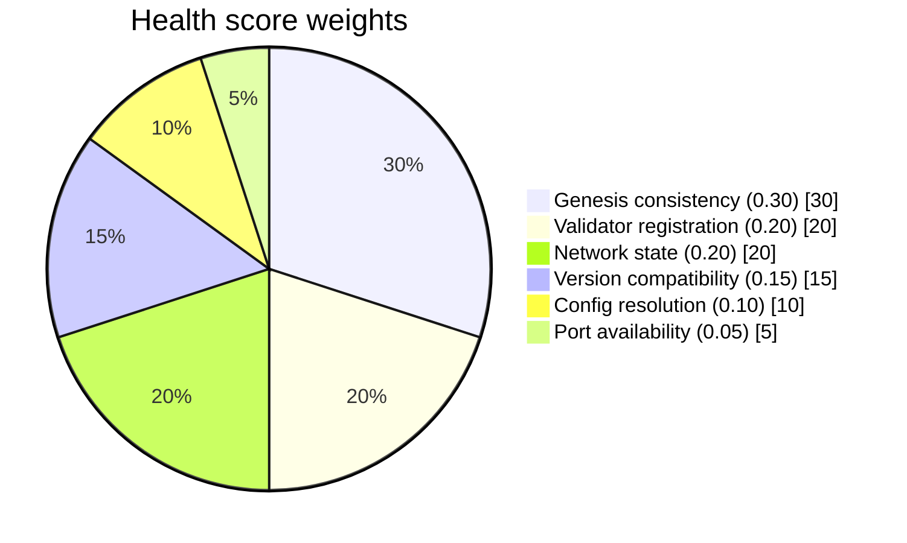

# Avalanche Deploy Assurance

[](https://aegis-psi-dun.vercel.app/)
[](./LICENSE)
[](./backend/package.json)
[](./backend)
[](./backend/test/integration)
[](./backend)
[](./src)

> Independent, read-only verification for Avalanche L1 deploys — six checks, a weighted health score, a CLI, and a JSON API, run directly against live RPC and P-Chain data instead of trusting any deploy tool's own status report. Plus the Next.js marketing/docs site that explains why.



`avalanche-cli` is the tool most Avalanche L1 builders use to create, deploy, and manage a chain. It entered maintenance mode in December 2025 — no new Ava Labs-built features, only security/critical fixes, external contributions welcomed. Meanwhile, open issues document a real pattern: the CLI sometimes reports a deploy or validator-add as successful when the underlying chain state disagrees.

| Issue | Problem | Impact |
|---|---|---|
| [#2594](https://github.com/ava-labs/avalanche-cli/issues/2594) | CLI reports deploy success while local network status disagrees | Chain appears broken when it isn't, or vice versa |
| [#2526](https://github.com/ava-labs/avalanche-cli/issues/2526) | `addValidator` transaction succeeds but the validator set query comes back empty | Fees charged, validator never actually added |
| [#2535](https://github.com/ava-labs/avalanche-cli/issues/2535) | `config.json` silently ignored, ports randomize after the Etna upgrade | Port mismatch, clients can't reconnect |
| [#2458](https://github.com/ava-labs/avalanche-cli/issues/2458) | A Ledger signature failure forces a full re-run and re-charges subnet fees | Builder loses funds with no recovery path |

**Contents:** [Architecture](#architecture) · [Status](#status-this-is-real-working-and-live-tested) · [The six checks](#the-six-checks) · [Health score](#health-score) · [CLI](#cli) · [JSON API](#json-api) · [Repository structure](#repository-structure) · [Testing](#testing-the-backend) · [Known gaps](#known-gaps) · [Documentation](#documentation) · [The frontend](#the-frontend) · [Contributing](#contributing)

This repo closes that gap without touching the CLI itself: it reads directly from the live RPC and P-Chain, never trusting a deploy tool's own status report as ground truth. Every check either returns a real pass/fail/warn or honestly reports `unavailable` when the data it needs isn't reachable — it never fabricates a passing result.

```bash
cd backend
npm install && npm run build
node dist/cli/index.js verify --network fuji --node-id <NodeID>
```

## This is a monorepo

Two things live here together — an npm workspace (`backend` is a workspace member of the root `package.json`), not separate repos:

- **`backend/`** — the real verification engine (this README's main subject below): six checks, a health score, a CLI, and a JSON API. Node/TypeScript, not a Go binary — see [Known gaps](#known-gaps) for why some older design docs say otherwise.
- **`src/`** — the Next.js marketing/docs site (Tech Stack / Getting Started / Project Structure for *this* part are further down, under [The frontend](#the-frontend)). Its `src/app/api/verify/` routes import `backend/dist/` directly, which is how one `npm run build` and one Vercel deploy serve both.

## Architecture



P-Chain reads go through [`@avalabs/avalanchejs`](https://www.npmjs.com/package/@avalabs/avalanchejs)'s `PVMApi`; Info/Health/Admin/chain-RPC calls use raw `fetch`-based JSON-RPC (that SDK doesn't wrap those APIs). Any check that can't reach what it needs returns `unavailable` — it never fabricates a `pass`.

## Status: this is real, working, live-tested, and deployed

Everything in `backend/` is implemented, not planned, and the live site actually calls it:

- **Live at [aegis-psi-dun.vercel.app](https://aegis-psi-dun.vercel.app/)** — frontend and backend deployed together on Vercel via `src/app/api/verify/` (Next.js API routes that import backend's compiled `dist/` output directly, no separate host, no CORS).
- **51 unit tests pass** (`npm test` inside `backend/` — fast, mocked, no network).
- **4 integration tests pass against real Fuji testnet infrastructure right now** (`npm run test:integration`) — genesis consistency and validator registration are verified against live P-Chain and C-Chain data, not fixtures.
- Typecheck and build are clean, including the full `npm run build` (backend build → Next.js build) Vercel actually runs.
- **The homepage's "See It Live" demo calls the real backend** — `GET /api/verify/demo` looks up a currently-connected Fuji validator live (not a hardcoded NodeID) and runs all six checks against it plus Fuji C-Chain's genesis and RPC. Not a simulation; two of the six checks honestly show `unavailable` there since a public demo has no AvalancheGo node of its own to point at (see [Known gaps](#known-gaps)).

## The six checks

| Check | What it does | What it needs | Live-tested against |
|---|---|---|---|
| **Port availability** | Local socket test on Avalanche's default staking (9651) and API (9650) ports | Nothing | Local sockets — always works |
| **Validator registration** | Queries `platform.getCurrentValidators` for a NodeID's registration, connection, uptime, and weight | `--network` (public P-Chain) or `--node-url` (your own node) | Real Fuji testnet data |
| **Genesis consistency** | Looks up the on-chain genesis-creation transaction (a blockchain's ID *is* the ID of the P-Chain `CreateChainTx` that created it) and compares its declared `chainId` against what the live chain currently reports — no local genesis file needed | `--blockchain-id` + `--network`/`--node-url` (P-Chain), plus `--chain-rpc-url` or `--node-url`+`--blockchain-id` (chain RPC) | Real Fuji P-Chain + C-Chain, full round trip |
| **Network state** | Two independent halves: the node's own Health API (`/ext/health`), and direct RPC reachability on the target chain (`eth_blockNumber`) | Chain-RPC half: `--chain-rpc-url` or `--node-url`+`--blockchain-id` (public-reachable); Health-API half: `--node-url` (your own node — not exposed on the public gateway) | Chain-RPC half live-tested against Fuji C-Chain; Health API half needs a real node to try live |
| **Version compatibility** | Compares a node's reported `rpcProtocolVersion` (`info.getNodeVersion`) against subnet-evm's own published `compatibility.json` | `--node-url` (Info API is node-specific, not on the public gateway) | Compatibility data sourced from real subnet-evm release data; the check itself needs a real node to try live end-to-end |
| **Config resolution** | Checks the Admin API's resolved config (`admin.getConfig`) for a handful of well-known flags — no canonical schema is published by Ava Labs, so this is a project-owned, intentionally narrow schema | `--node-url` with `--api-admin-enabled=true` (disabled by default even on your own node) | Needs a real node to try live |

Three checks (network state, version compatibility, config resolution) need Info/Health/Admin APIs that **AvalancheGo does not expose on the public API server** — that's a platform design decision, not a limitation of this tool. Point Aegis at your own node (`--node-url`) to unlock them. No check ever fabricates a pass: if the data it needs isn't reachable, it returns `unavailable` with a specific reason.

The site's `/docs` page groups the six checks by what they look at — your node, or your deployed chain — screenshots below (all six run together in one pass; this is a grouping for explanation, not separate CLI stages):

<table>
<tr>
<td></td>
<td></td>
</tr>
</table>

**Genesis consistency**, the differentiator no other tool covers — a blockchain's ID *is* the ID of the P-Chain transaction that created it, so the exact genesis submitted at chain creation can be looked up on-chain, no local file needed:



Full detail and design rationale for each check: [`backend/README.md`](./backend/README.md).

## Health score

A single 0.0–1.0 number, computed in `backend/src/score/computeHealthScore.ts`:

| Check | Weight | Why |
|---|---|---|
| Genesis consistency | 0.30 | Hardest failure to recover from; the check no other tool covers |
| Validator registration | 0.20 | A validator silently missing/disconnected means the deploy isn't actually securing anything, even if everything else looks fine |
| Network state | 0.20 | An unhealthy node or unreachable chain RPC means nothing else in the report can be trusted as current |
| Version compatibility | 0.15 | Real risk, but well-documented with a clear fix (upgrade one side) |
| Config resolution | 0.10 | Usually a misconfiguration to fix, not evidence the chain is broken; also the narrowest-scoped check |
| Port availability | 0.05 | Almost always transient and trivially fixable |



Scoring: pass = full credit, warn = half credit, fail = zero credit. A check that returns `unavailable` is excluded from both the numerator and the weight total — the remaining weights are renormalized across whatever actually ran, and every `unavailable` check is listed in the report's `skipped` array with its reason. A score never gets inflated by silently dropping checks the caller doesn't notice are missing.

## CLI

```bash
cd backend
node dist/cli/index.js verify [nodeUrl] [options]

  --node-url <url>          AvalancheGo node base URL, for Info/Health/Admin API checks
  --network <network>       mainnet | fuji | local — used for P-Chain checks when no nodeUrl is given
  --node-id <nodeId>        NodeID to look up in the validator set
  --subnet-id <subnetId>    Subnet ID to scope validator/health checks to
  --blockchain-id <id>      Blockchain ID, for genesis consistency / network state via nodeUrl
  --chain-rpc-url <url>     The chain's own RPC URL, for genesis consistency / network state
  --ports <ports>           Comma-separated ports to check for availability
  --json                    Output the full report as JSON instead of a human-readable summary
```

Exit code is `1` if any check returned `fail`, `0` otherwise (an `unavailable` check is not treated as failure).

```bash
# Public Fuji data only
node dist/cli/index.js verify --network fuji --node-id NodeID-... --json

# Against your own node — unlocks network-state / version-compatibility / config-resolution
node dist/cli/index.js verify --node-url http://localhost:9650 --node-id NodeID-...
```

## JSON API

```bash
cd backend
PORT=8787 node dist/api/server.js

curl -X POST localhost:8787/verify -H 'content-type: application/json' \
  -d '{"network":"fuji","nodeId":"<NodeID>"}'
```

Response shape (`VerifyReport`, `backend/src/verify.ts`):

```json
{
  "target": { "network": "fuji", "nodeId": "NodeID-..." },
  "results": [
    { "id": "port-availability", "name": "Port availability", "status": "pass", "message": "...", "details": {}, "durationMs": 3 }
  ],
  "score": 0.85,
  "skipped": [{ "id": "network-state", "reason": "No nodeUrl specified..." }],
  "timestamp": "2026-08-11T14:00:00.000Z"
}
```

CLI and API share the exact same `verify()` function so their output can never drift apart.

## Repository structure

```
avalanche-deploy-assurance-website/   # this repo, npm workspaces monorepo
├── src/                               # Next.js frontend — see "The frontend" below
│   └── app/api/verify/                # calls backend/dist/ directly — see "Architecture" above
├── backend/                           # the real verification engine, an npm workspace package
│   ├── src/
│   │   ├── checks/                    # the six checks
│   │   ├── score/computeHealthScore.ts
│   │   ├── api/server.ts              # Fastify JSON API (standalone; the deployed site uses the
│   │   │                              #   Next.js API routes instead, not this server)
│   │   ├── cli/index.ts               # commander CLI
│   │   ├── lib/avalancheRpc.ts        # shared RPC helpers
│   │   ├── types/                     # CheckTarget/CheckResult + avalanchejs ambient types
│   │   └── verify.ts                  # shared orchestrator (CLI + both APIs call this)
│   ├── dist/                          # compiled output — what the deployed site actually imports
│   ├── test/                          # unit (mocked) + integration (live Fuji)
│   └── README.md                      # backend-specific documentation
├── .github/workflows/                 # includes aegis-verify.yml.example — CI gate template
└── README.md                          # this file
```

## Testing the backend

```bash
cd backend
npm test                 # 51 tests, fast, mocked, no network — the default
npm run test:integration # 4 tests, hits real Fuji testnet infrastructure
npm run typecheck
```

## What it is not

- Not a fork or modification of `avalanche-cli`.
- Not a transaction signer — it never handles private keys, never signs, never submits transactions.
- Not a monitoring daemon — every run is a stateless, one-shot check pass.

## Known gaps

Tracked honestly rather than silently left for someone to discover.

**Fixed:**

- ~~Frontend isn't wired to the backend~~ — `/api/verify` and `/api/verify/demo` (Next.js API routes) now call the real backend; the homepage demo shows real results.
- ~~`src/lib/checks.ts` check names didn't match the backend~~ — corrected, and `/docs`'s tab copy relabeled honestly (grouped by what a check looks at, not a fake preflight/postdeploy stage split).
- ~~`/architecture` had stale Go-era copy~~ ("cobra commands," a "CLI config parser," staged commands) — rewritten to describe the real four layers.
- ~~`/solution` had fake `avalanche-deploy-assurance preflight`/`verify` commands and a "diffs against what the CLI claimed" claim~~ — rewritten to describe the real single `aegis verify` command and what it actually does (no CLI-claim diffing exists).
- ~~`/roadmap` described a fictional unbuilt 10-week Go plan~~ (`doctor` command, binary releases, etc.) — replaced with actual project status; V2 items kept, since those actually are honestly-labeled future/evidence-gated aspirations, not claims about what exists today.

**Still open:**

- **Project naming is inconsistent.** The GitHub repo is `Aegis-`, the backend package is `@aegis/backend` with CLI binary `aegis`, but this file's own page title/metadata (`src/app/layout.tsx`) say "Avalanche Deploy Assurance," which is what this README uses. Not yet resolved which name is canonical.
- **The public demo can't exercise every check.** `/api/verify/demo` has no AvalancheGo node of its own, so network-state's Health-API half, version compatibility, and config resolution always show `unavailable` there — correct behavior, not a bug, but worth knowing before assuming the live demo proves all six checks work (the backend's own live-Fuji integration tests cover more of them; see [Testing](#testing-the-backend)).
- **14 of the 18 docs below haven't been individually re-verified against the real implementation.** `docs/03`, `04`, `06`, and `07` were rewritten to match the actual TypeScript backend (they previously described an unbuilt Go design) before being imported into this repo, along with `CONTRIBUTING.md`. The remaining 14 — whitepaper, milestones, competitive analysis, grant proposal, etc. — were imported as-is and may still contain assumptions from before the backend existed (e.g. `docs/10-mvp-scope.md`'s original 3+3 preflight/postdeploy check split, which doesn't match the real flat six-check design). Treat this README and `backend/README.md` as the source of truth for anything they contradict.

## Documentation

| Doc | Contents | Status |
|---|---|---|
| [Executive Summary](./docs/01-executive-summary.md) | Problem, solution, impact | Not individually re-verified against the real implementation |
| [Whitepaper](./docs/02-whitepaper.md) | Full technical/positioning writeup | Not individually re-verified against the real implementation |
| [Engineering Design](./docs/03-engineering-design.md) | Modules, interfaces, internals | Rewritten to match the real TypeScript backend |
| [Technical Specification](./docs/04-technical-specification.md) | Commands, flags, JSON schema | Rewritten to match the real TypeScript backend |
| [System Architecture](./docs/05-system-architecture.md) | Mermaid diagrams | Not individually re-verified against the real implementation |
| [Repository Structure](./docs/06-repository-structure.md) | Full repo layout | Rewritten to match the real TypeScript backend |
| [Developer Docs](./docs/07-developer-documentation.md) | Install, usage, FAQ | Rewritten to match the real TypeScript backend |
| [Grant Proposal](./docs/08-grant-proposal.md) | Team1 Mini Grant application | Not individually re-verified against the real implementation |
| [Milestones](./docs/09-milestones.md) | Week-by-week plan | Not individually re-verified against the real implementation |
| [MVP Scope](./docs/10-mvp-scope.md) | What v1 ships and doesn't | Describes the original 3+3 preflight/postdeploy split, which doesn't match the real flat six checks |
| [V2 Roadmap](./docs/11-v2-roadmap.md) | Evidence-gated future features | Not individually re-verified against the real implementation |
| [Security](./docs/12-security.md) | Threat model, failure modes | Broadly still accurate — no signing/write capability was added |
| [Competitive Analysis](./docs/13-competitive-analysis.md) | vs. every adjacent tool | Not individually re-verified against the real implementation |
| [Business Case](./docs/14-business-case.md) | OSS/maintenance rationale | Not individually re-verified against the real implementation |
| [Landing Page Copy](./docs/15-landing-page-copy.md) | Marketing copy | Not individually re-verified against the real implementation |
| [Release Plan](./docs/16-release-plan.md) | v0.1 → v1.0 | Not individually re-verified against the real implementation |
| [License Recommendation](./docs/17-license-recommendation.md) | License rationale | Still accurate |
| [Critical Review](./docs/20-critical-review.md) | Adversarial self-review | Worth reading — its scoring-formula concern is addressed above (weights are now documented per-check), its process concerns still stand |

See also [`CONTRIBUTING.md`](./CONTRIBUTING.md) (rewritten to match the real backend) and [`QUICKSTART.md`](./QUICKSTART.md) (frontend-focused, lightly corrected).

## The frontend

**Tech stack:** [Next.js 16](https://nextjs.org) (App Router, Turbopack), [React 19](https://react.dev), TypeScript, [Tailwind CSS v4](https://tailwindcss.com), [Framer Motion](https://www.framer.com/motion), [Lucide React](https://lucide.dev).

**Getting started:**

```bash
git clone https://github.com/Hermit210/Aegis-.git
cd Aegis-
npm install
npm run dev
```

Open [http://localhost:3000](http://localhost:3000). Hot-reloads as you edit `src/`.

**Scripts:** `npm run dev` (hot reload), `npm run build` (production build), `npm run start` (serve production build), `npm run lint` (ESLint).

**Structure:** each nav item is its own route.

```
src/
├── app/
│   ├── page.tsx          # Homepage — Hero + Demo + CTA
│   ├── layout.tsx        # Root layout, metadata
│   ├── globals.css       # Design tokens (colors, base styles)
│   ├── problem/page.tsx
│   ├── solution/page.tsx
│   ├── features/page.tsx
│   ├── architecture/page.tsx
│   ├── docs/page.tsx
│   ├── roadmap/page.tsx
│   └── api/verify/       # calls the real backend — route.ts (generic) + demo/route.ts (homepage)
└── components/
    ├── Navigation.tsx    # Sticky header
    ├── Footer.tsx        # Footer with links
    └── sections/
        ├── Hero.tsx           # Headline + animated terminal preview
        ├── Problem.tsx        # The four GitHub issues above — /problem
        ├── Solution.tsx       # Before/after workflow comparison — /solution
        ├── Features.tsx       # Capability grid — /features
        ├── Demo.tsx           # Live verification run via /api/verify/demo — on homepage, real backend
        ├── Architecture.tsx   # Four-layer system design — /architecture
        ├── Roadmap.tsx        # Delivery timeline — /roadmap
        ├── OpenSource.tsx     # OSS commitments, how to contribute — /docs
        └── CTA.tsx            # Install commands, final call to action
```

**Design system:** colors are defined once as CSS custom properties in `src/app/globals.css` and consumed everywhere through Tailwind's `@theme inline` mapping.

| Token | Value | Use |
|---|---|---|
| `--background` | `#0A0808` | Page background |
| `--surface` | `#150F10` | Alternating section background |
| `--card` | `#1E1516` | Card backgrounds |
| `--primary` | `#9E1B32` | Brand color — buttons, links, accents |
| `--secondary` | `#C4283F` | Hover states, gradient partner |
| `--highlight` | `#FF4667` | Emphasis text, code accents |
| `--foreground` | `#F5EDEE` | Primary text |
| `--text-secondary` | `#C9B8BB` | Secondary text |
| `--text-tertiary` | `#8F7A7D` | Meta/tertiary text |
| `--border` | `#2E2225` | Borders and dividers |

Semantic colors (`--success`, `--warning`, `--error`, `--info`) are defined separately, kept distinct from the brand palette so status messaging stays unambiguous.

> **Note on the reset rule:** the global `* { margin: 0; padding: 0; }` reset in `globals.css` lives inside `@layer base`. Per the CSS Cascade Layers spec, an *unlayered* rule would silently beat every Tailwind utility (`px-*`, `py-*`, etc.) regardless of specificity — keep it layered if you touch this file.

**Deployment:**

```bash
# Vercel (recommended) — connect this repo for automatic deploys on push to main, or:
vercel deploy

# Self-hosted
npm run build && npm run start
```

```dockerfile
FROM node:20-alpine
WORKDIR /app
COPY . .
RUN npm install
RUN npm run build
EXPOSE 3000
CMD ["npm", "run", "start"]
```

## Contributing

See [`CONTRIBUTING.md`](./CONTRIBUTING.md) for the full guide. For the verification engine: new checks are the primary contribution surface — add a file to `backend/src/checks/`, register it in `backend/src/checks/index.ts`, and give it a weight in `backend/src/score/computeHealthScore.ts`. See [`backend/README.md`](./backend/README.md).

For the frontend: fork, branch, keep colors flowing through the CSS tokens in `globals.css` rather than hardcoding them in components, run `npm run lint` before opening a PR.

Resolving the project-naming inconsistency (see [Known gaps](#known-gaps)) is an open, well-scoped contribution.

## License

MIT — see [`LICENSE`](./LICENSE).

---

Built for the Avalanche L1 builder community.
