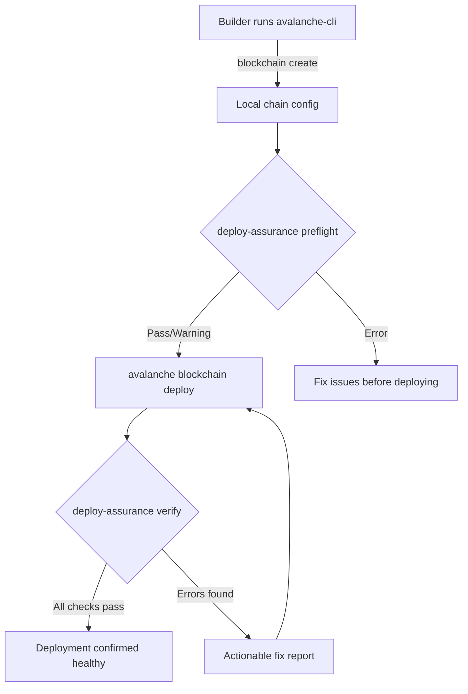
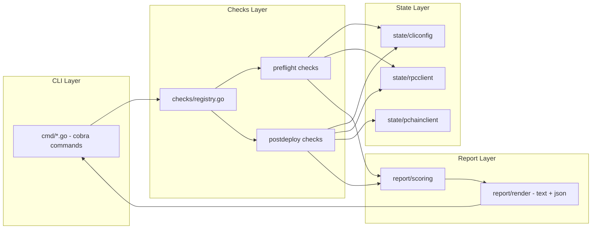
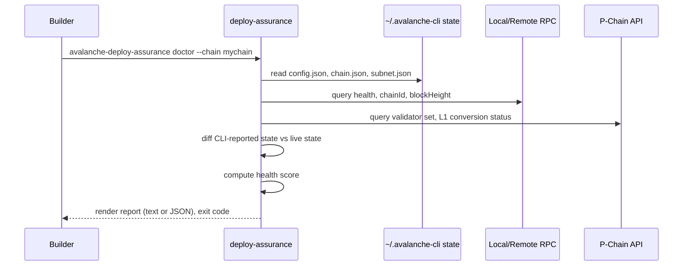
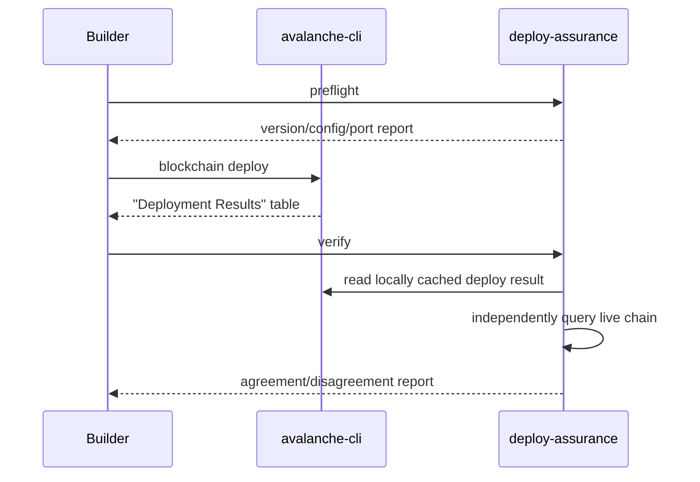

# System Architecture

## High-Level Flow

## Module Interaction

## Sequence Diagram — `doctor` Command

## Deployment Flow — Where Each Check Fires

## Data Flow Notes

- No component in this architecture writes to chain state or to `avalanche-cli`'s own files. All arrows into `CLIState`, `RPC`, and `PChain` in the sequence diagrams are reads.
- The tool has no persistent daemon or background process in v1 — every invocation is a fresh, stateless check run. This is a deliberate simplicity choice for MVP; a watch/daemon mode is a V2 candidate (Document 11), not v1 scope.
