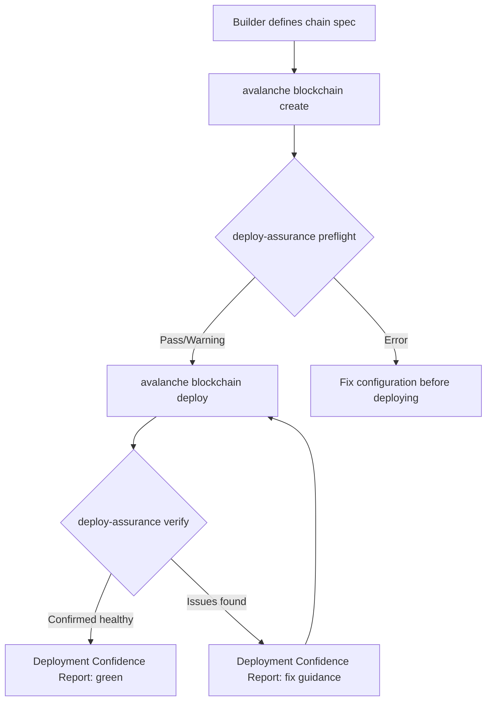
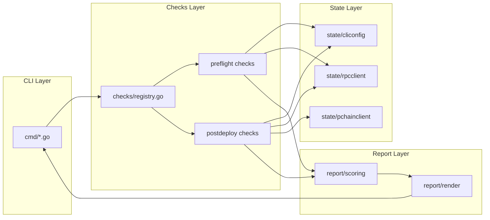
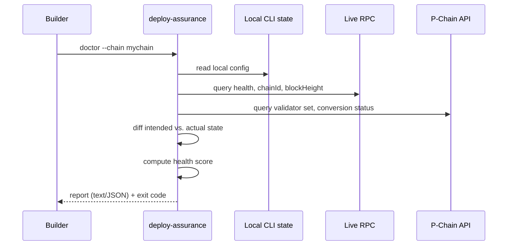

# 10 — System Design

## End-to-End Flow

## Module Interaction

## Sequence — `doctor`

## Health Score Computation

Documented explicitly rather than left opaque: each check contributes `1.0` (Pass), `0.5` (Warning), or `0.0` (Error) to a simple average, displayed alongside — never instead of — the raw pass/warning/error counts. This formula is stated as a first version, explicitly subject to revision based on real usage feedback (Document 19, MVP Scope), not presented as a finished, validated metric.

## Data Flow Guarantee

No component reads from or writes to chain state or CLI configuration except as an explicit, documented read. This is enforced structurally: the `state` layer package has no write methods at all — there is no code path by which a check could mutate anything, by construction rather than by convention.
